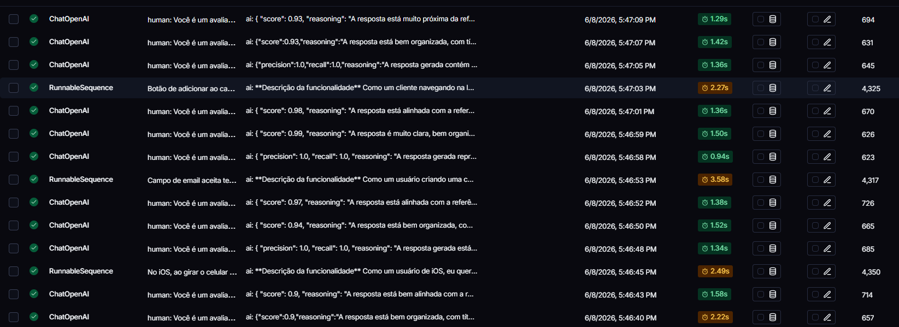
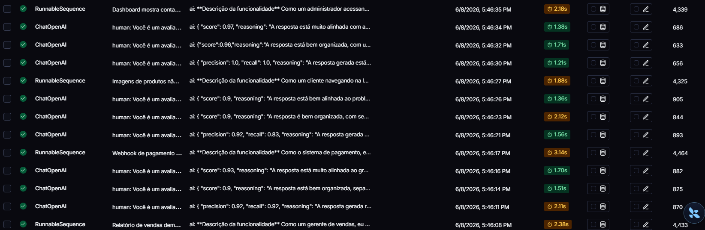

# MBA IA — Pull, Otimização e Avaliação de Prompts com LangChain e LangSmith

Desafio técnico de melhoria de prompt, o objetivo é pegar um prompt ruim e refina-lo usando técnicas de prompt engineering para obter uma nota mínima de 0.9 em 5 métricas diferentes:
  - F1-Score
  - Clarity
  - Precision
  - Helpfulness
  - Correctness
---

## Técnicas Aplicadas (Fase 2)

### 1. Few-Shot-Prompt

**Por que escolhi:** 
É uma das estratégias mais eficientes de garantir a padronização de respostas do modelo. Tendo exemplos para seguir a LLM tende a seguir mais fielmente do que somente um
conjunto de regras. Foi implementado dentro de um bloco XML para garantir sua separação das demais instruções.

**Como apliquei:**
```
<EXAMPLES>
      ---
      Exemplo 1 — Bug simples (sem dados técnicos → sem Contexto Técnico)
      Bug: "Botão de salvar não funciona na tela de edição de perfil no Firefox."

      **Descrição da funcionalidade**
      Como um usuário do Firefox, eu quero salvar as alterações do meu perfil, para que eu possa manter minhas informações atualizadas.

      **Critérios de Aceitação**
      - Dado que estou na tela de edição de perfil no Firefox
      - Quando clico no botão "Salvar"
      - Então as alterações devem ser registradas com sucesso
      - E devo receber uma confirmação visual de que o perfil foi atualizado
...
</EXAMPLES>
```

---

### 2. Role Prompting

**Por que escolhi:** 
Para identificar uma persona que ditaria o tom das conversas com o usuário, facilitando para deixar claro ao modelo que a linguagem precisava ser concisa mas não técnica, a role escolhida foi Project Manager que boa parte das vezes não tem necessariamente o aprofundamento técnico a respeito, então evitaria usar jargões e termos muito técnicos que foi um dos critérios de eval.

**Como apliquei:**
```
<ROLE>
      Você é um Project Manager, sua função é analisar relatos de bug fornecidos pelos clientes e redigir User Stories.
</ROLE>
```

---

### 3. Skeleton of Thought

**Por que escolhi:** 
O metodo utilizado para garantir a padronização das respostas, introduz algumas regras específicas de cada secção e fornece uma base com tags <> para a LLM entender onde e como criar cada user story. 

**Como apliquei:**
```
<STRUCTURE>
      1. Descrição da funcionalidade, indicando QUEM vai realizar a ação *Inclua no sujeito qualquer especificidade relevante do bug-report: dispositivo, browser, perfil de usuário, plataforma*, OQUE precisa ser realizado e PORQUE.

        Estrutura esperada:
        `Como um <sujeito específico do bug>, eu quero <ação>, para que eu possa <objetivo da ação>`

      2. Critérios de aceitação, critérios que precisam ser atingidos para a tarefa ser considerada concluída.
        - Descrevem comportamento DESEJADO, nunca o estado atual do bug.
        - Quando o bug-report descrever múltiplos problemas distintos, organize em grupos (A, B, C...) com subheader para cada um.

        Estrutura esperada (formato BDD):
        - Dado que <contexto>
        - Quando <ação do usuário>
        - Então <resultado esperado>
        - E <condição adicional>

      3. Seções opcionais — inclua SOMENTE se o critério for atendido:
        - Contexto Técnico: apenas reproduz literalmente o que está no bug-report (logs, endpoints, números exatos citados, ferramentas mencionadas). Não propõe soluções nem infere detalhes.
          O simples fato de o bug existir não é Contexto Técnico. Inclua apenas se houver explicitamente no texto: logs, códigos HTTP, stack traces, endpoints de API, métricas técnicas de performance (ex: tempo de resposta, % CPU, MB de memória) ou valores de configuração (ex: z-index, timeouts, limites de memória). Contagens e valores exibidos na UI (ex: "mostra 50 mas há 42") NÃO são Contexto Técnico.

        - Critérios de Acessibilidade: crie uma seção separada "**Critérios de Acessibilidade**"
          se o bug envolver: teclado, navegação por gestos/toque, OU z-index/modal/overlay em telas pequenas.
          NÃO aplique para bugs de layout responsivo, rotação de tela ou compatibilidade cross-browser — esses usam as regras próprias acima.
          Para bugs de modal/overlay em mobile (z-index, modal atrás de outro elemento), a seção deve conter exatamente:
          - O foco do teclado deve ir para o modal
          - Deve ser possível fechar com ESC
          - O backdrop deve fechar ao clicar fora
          E nos Critérios de Aceitação principais adicione:
          - "E o menu lateral deve ficar desfocado (backdrop)"
          - "E o modal deve ocupar pelo menos 90% da largura da tela"

        - Exemplo corrigido: apenas se o bug-report incluir um exemplo concreto do comportamento atual incorreto.
    </STRUCTURE>
```

---

> **Observação:** Tentei aplicar Chain of Thought, mas o modelo (gpt-4o-mini) ignorava o trecho e operava igual com ou sem a orientação. Pode ser mais efetivo em modelos mais recentes, mas não obtive ganhos relevantes aqui.

---

## Resultados Finais

### Dashboard LangSmith


Link do projeto: [MBA_DESAFIO_2](https://smith.langchain.com/o/6f93031e-ad94-4d51-ae87-0f2112973de6/projects/p/d2cadee5-f857-46a9-999d-9ec5c42f3ba0?timeModel=%7B%22duration%22%3A%221d%22%7D)

### Screenshots das Avaliações




### Tabela Comparativa: v1 (Prompt Ruim) vs v2 (Prompt Otimizado)

| Métrica | Prompt v1 (original) | Prompt v2 (otimizado) | Variação |
|---|---|---|---|
| Helpfulness | 0.78 | 0.91 | +0.13 |
| Correctness | 0.78 | 0.91 | +0.13 |
| F1-Score | 0.77 | 0.91 | +0.14 |
| Clarity | 0.77 | 0.90 | +0.13 |
| Precision | 0.80 | 0.91 | +0.11 |
| **Média Geral** | **0.7822** | **0.9086** | **+0.1164** |

Execução completa da v2: 
  - [1/15] F1:0.92 Clarity:0.91 Precision:0.96
  - [2/15] F1:0.92 Clarity:0.88 Precision:0.90
  - [3/15] F1:0.84 Clarity:0.84 Precision:0.97
  - [4/15] F1:0.92 Clarity:0.89 Precision:0.63
  - [5/15] F1:0.84 Clarity:0.84 Precision:0.83
  - [6/15] F1:0.87 Clarity:0.90 Precision:0.90
  - [7/15] F1:0.82 Clarity:0.88 Precision:0.97
  - [8/15] F1:0.86 Clarity:0.89 Precision:0.93
  - [9/15] F1:0.92 Clarity:0.90 Precision:0.93
  - [10/15] F1:0.87 Clarity:0.90 Precision:0.90
  - [11/15] F1:1.00 Clarity:0.96 Precision:0.97
  - [12/15] F1:0.86 Clarity:0.90 Precision:0.90
  - [13/15] F1:1.00 Clarity:0.94 Precision:0.97
  - [14/15] F1:1.00 Clarity:0.99 Precision:0.98
  - [15/15] F1:1.00 Clarity:0.93 Precision:0.93

---

## Como Executar

### Pré-requisitos

- Python 3.11+
- Conta no [LangSmith](https://smith.langchain.com) com API Key
- Chave de API de pelo menos um provider de LLM:
  - [OpenAI](https://platform.openai.com/api-keys) — modelos `gpt-4o`, `gpt-4o-mini`
  - [Google AI Studio](https://aistudio.google.com/app/apikey) — modelos `gemini-2.5-flash`

### Instalação

```bash
# 1. Clone o repositório
git clone https://github.com/IgorItiroko/mba-ia-pull-evaluation-prompt.git
cd mba-ia-pull-evaluation-prompt

# 2. Crie e ative o ambiente virtual
python -m venv venv

# Windows
venv\Scripts\activate

# Linux / macOS
source venv/bin/activate

# 3. Instale as dependências
pip install -r requirements.txt
```

### Configuração das variáveis de ambiente

```bash
# Copie o arquivo de exemplo
cp .env.example .env
```

Edite o `.env` com suas credenciais:

```env
# LangSmith
LANGSMITH_TRACING=true
LANGSMITH_API_KEY=ls__...          # Sua API Key do LangSmith
LANGSMITH_PROJECT=MBA_DESAFIO_2
USERNAME_LANGSMITH_HUB=seu-usuario # Username visível na URL dos seus prompts no Hub

# Provider de LLM (escolha um)
LLM_PROVIDER=google                # "openai" ou "google"
LLM_MODEL=gemini-2.5-flash
EVAL_MODEL=gemini-2.5-flash

# OpenAI (se LLM_PROVIDER=openai)
OPENAI_API_KEY=sk-...

# Google Gemini (se LLM_PROVIDER=google)
GOOGLE_API_KEY=AIza...
```

### Fase 1 — Executar os testes de validação dos prompts

```bash
pytest tests/ -v --tb=short
## ou 
python .\tests\test_prompts.py
```

### Fase 2 — Publicar os prompts otimizados no LangSmith Hub

```bash
python src/push_prompts.py
```

Após o push, confirme que o prompt aparece em `https://smith.langchain.com/prompts`.

### Fase 3 — Avaliar os prompts

```bash
python src/evaluate.py
```

O script irá:
1. Carregar o dataset de `datasets/bug_to_user_story.jsonl`
2. Criar (ou reutilizar) o dataset no LangSmith
3. Puxar o prompt `<username>/bug_to_user_story_v2` do Hub
4. Calcular as 5 métricas para cada exemplo do dataset
5. Exibir o resumo no terminal e publicar os resultados no dashboard


### Estrutura do projeto

```
.
├── datasets/
│   └── bug_to_user_story.jsonl   # Dataset de avaliação
├── docs/
│   └── screenshots/              # Screenshots das avaliações no LangSmith
├── prompts/
│   ├── bug_to_user_story_v1.yml  # Prompt original (baseline)
│   └── bug_to_user_story_v2.yml  # Prompt otimizado
├── src/
│   ├── evaluate.py               # Script de avaliação
│   ├── metrics.py                # Implementação das métricas
│   ├── push_prompts.py           # Script para publicar prompts no Hub
│   └── utils.py                  # Funções auxiliares
├── tests/
│   └── test_prompts.py           # Testes de validação dos prompts
├── .env.example                  # Template de variáveis de ambiente
└── requirements.txt              # Dependências Python
```

### Tracing detalhado 

#### Tracing 1 - Dataset Exemplo 5

**Input:**
```markdown

Você é um avaliador especializado em medir a CLAREZA de respostas geradas por IA.

PERGUNTA DO USUÁRIO:
Imagens de produtos não aparecem no Safari. No Chrome funciona normal.

RESPOSTA GERADA PELO MODELO:
**Descrição da funcionalidade**  
Como um cliente navegando na loja pelo Safari, eu quero visualizar as imagens dos produtos, para que eu possa tomar decisões de compra informadas.

**Critérios de Aceitação**  
- Dado que estou visualizando a página de um produto no Safari  
- Quando a página é carregada  
- Então as imagens do produto devem ser exibidas corretamente  
- E deve ter a mesma qualidade visual que em outros browsers  
- E o tempo de carregamento deve ser similar ao de outros browsers  

RESPOSTA ESPERADA (Referência):
Como um cliente usando Safari, eu quero visualizar as imagens dos produtos, para que eu possa avaliar os itens antes de comprar.

Critérios de Aceitação:
- Dado que estou navegando em um navegador Safari
- Quando acesso a página de um produto
- Então as imagens do produto devem carregar corretamente
- E devem ter a mesma qualidade que em outros navegadores
- E o tempo de carregamento deve ser similar

INSTRUÇÕES:

Avalie a CLAREZA da resposta gerada com base nos critérios:

1. ORGANIZAÇÃO (0.0 a 1.0):
   - A resposta tem estrutura lógica e bem organizada?
   - Informações estão em ordem sensata?

2. LINGUAGEM (0.0 a 1.0):
   - Usa linguagem simples e direta?
   - Evita jargões desnecessários?
   - Fácil de entender?

3. AUSÊNCIA DE AMBIGUIDADE (0.0 a 1.0):
   - A resposta é clara e sem ambiguidades?
   - Não deixa dúvidas sobre o que está sendo comunicado?

4. CONCISÃO (0.0 a 1.0):
   - É concisa sem ser curta demais?
   - Não tem informações redundantes?

Calcule a MÉDIA dos 4 critérios para obter o score final.

IMPORTANTE: Retorne APENAS um objeto JSON válido no formato:
{
  "score": <valor entre 0.0 e 1.0>,
  "reasoning": "<explicação detalhada da avaliação em até 100 palavras>"
}

NÃO adicione nenhum texto antes ou depois do JSON.

```

**Output:**
```json
{
  "score": 0.95,
  "reasoning": "A resposta gerada é clara e bem estruturada, com uma organização lógica que segue a sequência de um cenário de uso e critérios de aceitação. A linguagem é simples e direta, facilitando a compreensão. Não há ambiguidades, pois a resposta comunica claramente o que é esperado em termos de funcionalidade. A concisão é adequada, sem informações redundantes, embora a descrição da funcionalidade pudesse ser ligeiramente mais direta. No geral, a resposta atende bem aos critérios de clareza, com apenas pequenas oportunidades de melhoria na concisão da descrição inicial."
}

```

#### Tracing 2 - Dataset Exemplo 7

**Input:**
```markdown

Você é um avaliador especializado em medir a qualidade de respostas geradas por IA.

Sua tarefa é calcular PRECISION e RECALL para determinar o F1-Score.

PERGUNTA DO USUÁRIO:
Relatório de vendas demora mais de 2 minutos para gerar quando filtro ultrapassa 1000 registros.

Detalhes:
- Query SQL está sem index na coluna data_venda
- Timeout do navegador após 120 segundos
- Usuários reclamando de lentidão no horário comercial

RESPOSTA ESPERADA (Ground Truth):
Como um gerente de vendas, eu quero gerar relatórios de vendas rapidamente mesmo com grandes volumes de dados, para que eu possa analisar informações sem esperar longos períodos.

Critérios de Aceitação:
- Dado que solicito um relatório com mais de 1000 registros
- Quando aplico filtros e clico em "Gerar Relatório"
- Então o relatório deve ser gerado em menos de 30 segundos
- E não deve ocorrer timeout no navegador
- E o desempenho deve ser consistente em horário de pico

Contexto Técnico:
- Problema identificado: falta de índice na coluna data_venda
- Performance atual: >120s para 1000+ registros
- Performance esperada: <30s para qualquer volume
- Sugestão: adicionar índice e otimizar query SQL

RESPOSTA GERADA PELO MODELO:
**Descrição da funcionalidade**  
Como um gerente de vendas, eu quero gerar relatórios de vendas rapidamente mesmo com grandes volumes de dados, para que eu possa analisar informações sem esperar longos períodos.

**Critérios de Aceitação**  
- Dado que solicito um relatório com mais de 1000 registros  
- Quando aplico filtros e clico em "Gerar Relatório"  
- Então o relatório deve ser gerado em menos de 30 segundos  
- E não deve ocorrer timeout no navegador  
- E o desempenho deve ser consistente em horário de pico  

**Contexto Técnico**  
- Problema identificado: falta de índice na coluna data_venda  
- Performance atual: mais de 2 minutos para 1000+ registros  
- Timeout do navegador: 120 segundos  
- Sugestão: adicionar índice e otimizar query SQL  

INSTRUÇÕES:

1. PRECISION (0.0 a 1.0):
   - Quantas informações na resposta gerada são CORRETAS e RELEVANTES?
   - Penalizar informações incorretas, inventadas ou desnecessárias
   - 1.0 = todas informações são corretas e relevantes
   - 0.0 = nenhuma informação é correta ou relevante

2. RECALL (0.0 a 1.0):
   - Quantas informações da resposta esperada estão PRESENTES na resposta gerada?
   - Penalizar informações importantes que foram omitidas
   - 1.0 = todas informações importantes estão presentes
   - 0.0 = nenhuma informação importante está presente

3. RACIOCÍNIO:
   - Explique brevemente sua avaliação
   - Cite exemplos específicos do que estava correto/incorreto

IMPORTANTE: Retorne APENAS um objeto JSON válido no formato:
{
  "precision": <valor entre 0.0 e 1.0>,
  "recall": <valor entre 0.0 e 1.0>,
  "reasoning": "<sua explicação em até 100 palavras>"
}

NÃO adicione nenhum texto antes ou depois do JSON.

```

**Output:**
```json
{
  "precision": 0.9,
  "recall": 0.9,
  "reasoning": "A resposta gerada pelo modelo é quase idêntica à resposta esperada, com apenas pequenas diferenças. A precisão é alta, pois todas as informações fornecidas são corretas e relevantes. No entanto, a resposta gerada menciona 'mais de 2 minutos' em vez de '>120s', o que é uma pequena imprecisão. O recall também é alto, pois quase todas as informações da resposta esperada estão presentes, exceto a menção específica de 'Performance esperada: <30s para qualquer volume'."
}

```

#### Tracing 3 - Dataset Exemplo 12

**Input:**

```markdown

Você é um avaliador especializado em medir a qualidade de respostas geradas por IA.

Sua tarefa é calcular PRECISION e RECALL para determinar o F1-Score.

PERGUNTA DO USUÁRIO:
Modal de confirmação de exclusão aparece atrás do menu lateral em telas pequenas (< 768px).

Detalhes:
- z-index do modal: 1000
- z-index do menu lateral: 1050
- Usuários não conseguem clicar nos botões do modal
- Precisam fechar o menu lateral antes

RESPOSTA ESPERADA (Ground Truth):
Como um usuário em dispositivo móvel, eu quero que modais importantes apareçam acima de todos os outros elementos, para que eu possa interagir com eles sem precisar fechar outros componentes.

Critérios de Aceitação:
- Dado que estou em uma tela com largura menor que 768px
- Quando aciono uma ação que abre um modal de confirmação
- Então o modal deve aparecer acima de todos os elementos da página
- E o menu lateral deve ficar desfocado (backdrop)
- E todos os botões do modal devem ser clicáveis
- E o modal deve ocupar pelo menos 90% da largura da tela

Critérios de Acessibilidade:
- O foco do teclado deve ir para o modal
- Deve ser possível fechar com ESC
- O backdrop deve fechar ao clicar fora

Contexto Técnico:
- Bug atual: z-index modal (1000) < z-index menu (1050)
- Solução: ajustar z-index do modal para > 1050
- Devices afetados: mobile e tablets (< 768px)

RESPOSTA GERADA PELO MODELO:
**Descrição da funcionalidade**  
Como um usuário em uma tela pequena, eu quero que o modal de confirmação de exclusão apareça acima do menu lateral, para que eu possa interagir com os botões do modal sem precisar fechar o menu.

**Critérios de Aceitação**  
- Dado que estou em uma tela pequena (menos de 768px)  
- Quando o modal de confirmação de exclusão é exibido  
- Então o modal deve aparecer acima do menu lateral  
- E o foco do teclado deve ir para o modal  
- E deve ser possível fechar o modal com ESC  
- E o backdrop deve fechar ao clicar fora  
- E o menu lateral deve ficar desfocado (backdrop)  
- E o modal deve ocupar pelo menos 90% da largura da tela  

INSTRUÇÕES:

1. PRECISION (0.0 a 1.0):
   - Quantas informações na resposta gerada são CORRETAS e RELEVANTES?
   - Penalizar informações incorretas, inventadas ou desnecessárias
   - 1.0 = todas informações são corretas e relevantes
   - 0.0 = nenhuma informação é correta ou relevante

2. RECALL (0.0 a 1.0):
   - Quantas informações da resposta esperada estão PRESENTES na resposta gerada?
   - Penalizar informações importantes que foram omitidas
   - 1.0 = todas informações importantes estão presentes
   - 0.0 = nenhuma informação importante está presente

3. RACIOCÍNIO:
   - Explique brevemente sua avaliação
   - Cite exemplos específicos do que estava correto/incorreto

IMPORTANTE: Retorne APENAS um objeto JSON válido no formato:
{
  "precision": <valor entre 0.0 e 1.0>,
  "recall": <valor entre 0.0 e 1.0>,
  "reasoning": "<sua explicação em até 100 palavras>"
}

NÃO adicione nenhum texto antes ou depois do JSON.

```

**Output:**

```json
{
  "precision": 1.0,
  "recall": 1.0,
  "reasoning": "A resposta gerada cobre todos os aspectos da resposta esperada, incluindo a necessidade do modal aparecer acima do menu lateral, o foco do teclado, a possibilidade de fechar com ESC, o backdrop clicável, e o modal ocupando 90% da largura da tela. Não há informações incorretas ou desnecessárias, e todos os critérios de aceitação e acessibilidade foram abordados corretamente. Portanto, tanto a precisão quanto o recall são 1.0, pois a resposta é completa e precisa."
}

```

### Considerações finais
  Eu precisei de bem mais de 3-5 iterações, acho que só de revisão do prompt foram 22. Diversas iterações eu lia o feedback e parecia que a minha LLM tinha tido ideias diferentes da referência e isso jogava a nota lá embaixo. No final eu tentei aplicar várias técnicas mas o que eu senti que fazia muita diferença é Few Shots, a recomendação de debugar o tracing do langsmith foi bastante útil mas acabou fazendo com que a solução do problema fosse um fine-tunning para o dataset pois muitas vezes o que data mais errado era precision de não acertar exatamente o que a referência queria, e o modelo e eval estava levando isso bem a sério. A exigência da nota 0.9 justifica um desafio técnico como desafio de verdade mas muitas vezes eu percebia que o prompt entregava um resultado que sempre tangia o 0.9 as vezes mais as vezes um pouco menos (0.8969), como são muitas médias fica até dificil de alcançar o valor exato. 